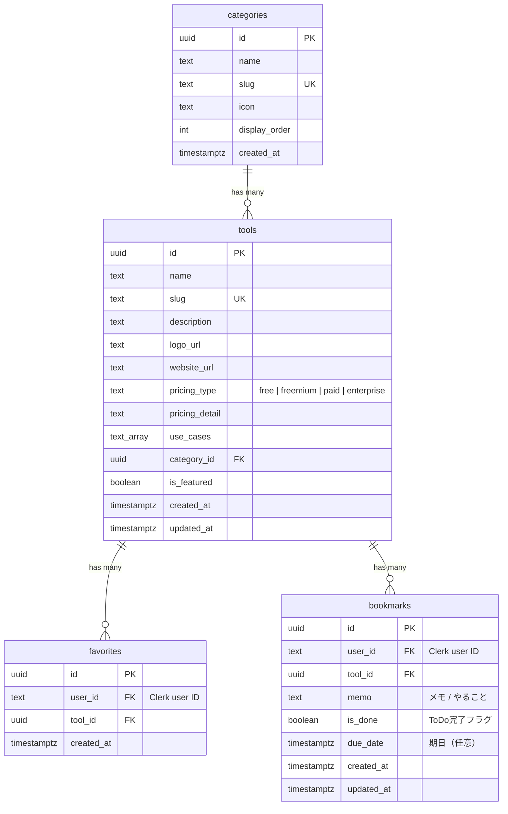

# ER図（データベース設計）

## テーブル補足

- **ユーザーテーブルは作らない**: Clerkが管理。`user_id`にClerkのuser IDを保存
- **favorites**: `user_id + tool_id` にユニーク制約（同じツールを重複登録させない）
- **bookmarks**: `memo`にToDo内容（例:「次の休日にCLAUDE.md設定を試す」）、`is_done`で完了管理
- **tools.pricing_type**: 4種（free / freemium / paid / enterprise）で絞り込み可能
