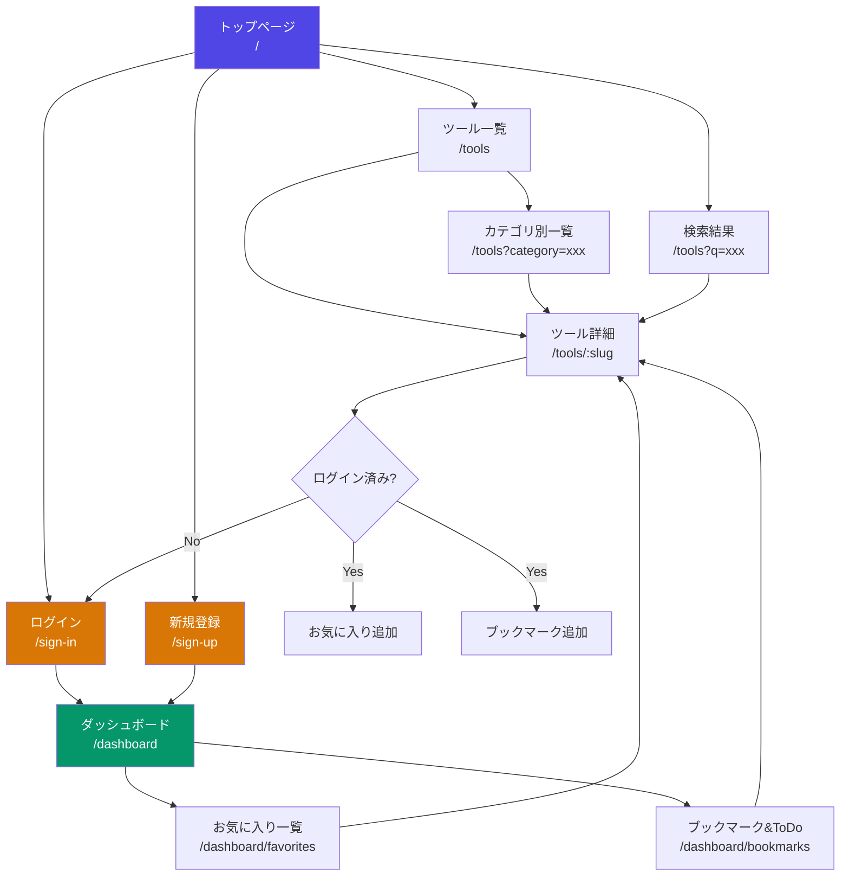

# 画面遷移図

## 画面一覧

| # | 画面名 | パス | 認証 | 説明 |
|---|--------|------|------|------|
| 1 | トップページ | `/` | 不要 | ヒーロー + 人気ツール + カテゴリ一覧 |
| 2 | ツール一覧 | `/tools` | 不要 | 全ツール一覧（カテゴリフィルタ・検索対応） |
| 3 | ツール詳細 | `/tools/[slug]` | 不要 | 概要・料金・用途・お気に入りボタン |
| 4 | ログイン | `/sign-in` | - | Clerk提供 |
| 5 | 新規登録 | `/sign-up` | - | Clerk提供 |
| 6 | ダッシュボード | `/dashboard` | 必要 | ユーザーのお気に入り・ブックマーク概要 |
| 7 | お気に入り一覧 | `/dashboard/favorites` | 必要 | お気に入り登録したツール一覧 |
| 8 | ブックマーク&ToDo | `/dashboard/bookmarks` | 必要 | ブックマーク + メモ付きToDoリスト |
